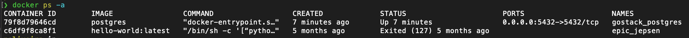
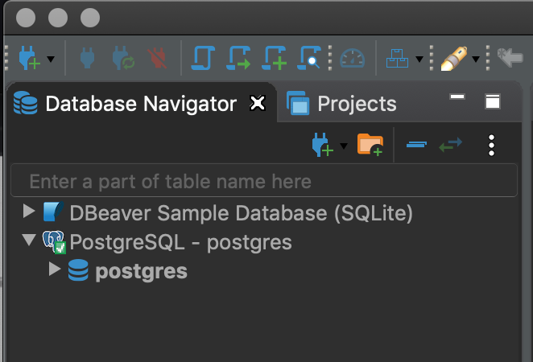
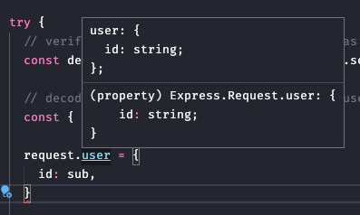

# README_Database

The exercise to practice this knowledge is in Rocketseat repository: "[Desafio 06: Banco de dados e upload de arquivos no Node.js](https://github.com/Rocketseat/bootcamp-gostack-desafios/tree/master/desafio-database-upload)"

And the tutorial is available [in this link](https://www.youtube.com/watch?v=aEUDRBBbo-Y)

- 3 strategies to use methods to manipulate database

    ## 3 strategies to use methods to manipulate database

    1. Using native drivers. Eg: Node-postgres for using postgres in node. Negative point: for an specific database.
    2. Using a query builder. To build queries using JS, then it will transform it in sql language. Eg: Knex.js
    3. ORM Object Relational Mapping. Map registers in db into js object = create models, and when we instantiate(create, delete, change) it will reflect in the db. Eg: Sequelize, [TypeORM](https://github.com/typeorm/typeorm) (better for ts, uses knex underneath)

    How does it works? This is how our model will look like (TypeORM example)

    ```jsx
    import {Entity, PrimaryGeneratedColumn, Column} from "typeorm";

    @Entity()
    export class User {

        @PrimaryGeneratedColumn()
        id: number;

        @Column()
        firstName: string;

        @Column()
        lastName: string;

        @Column()
        age: number;

    }
    ```

- Docker & PostgreSQL

    ## Docker & PostgreSQL

    Here we will use it to create isolated environments (container).

    We use doors to communicate among external services:

    

    Concepts

    - Images: tools, technologies that we can insert into our application
    - Container: an image instance
    - Docker Registry (Docker Hub): where we store all our dependencies and images
    - Dockerfile: it's out image recipe, everything out application needs to work

        

    - Creating a container in database - PostgreSQL
        1. go to official image. For Postgres in Docker is [this one.](https://hub.docker.com/_/postgres/) If you already have Postgres, first check if your door is occupy: **`lsof -i :5432`** > than run:  `docker run --name gostack_postgres -e POSTGRES_PASSWORD=docker -p 5432:5432 -d postgres` to create your image (you can also define which postgres version you want: `postgres:12`, if you leave it without choosing it will choose the latest)
            1. If the door is already in use, choose another door: the first door is yours, you can say 5533, 4,... the one available. But the second, is the docker door, this one MUST be 5432 `5433:5432`
        2. Check if is it running: `docker ps` and you will see the ID, how long is online and status: 

            

            1. `docker ps -a` will show all the dockers containers I have, where I can check to understand if I had an error

                

            2. With the id I can see all that is executing using docker logs + id: `docker logs 79f8d79646cd`

                

            3. This message means that is ready to used without issues: PostgreSQL init process complete; ready for start up
            4. To stop: docker stop +id: `docker stop79f8d79646cd`
        3. To restart after stopping or shutting down computer: `docker ps -a` > get the id or name > docker start +id | name: `docker start79f8d79646cd`  | `docker start gostack_postgres`
        4. Install [DBeaver](https://dbeaver.io/), a free and open source universal database tool for developers and database administrators
        5.  Configure DBeaver:
            1. Start a new connection (upper left corner) > Postgres

                

            2. Inform your door and password

                

            3. In PostgreSql mark: Show all databased

                

            4. Finish, you will see your databased created

                

- TypeORM & PostgreSQL

    ## TypeORM & PostgreSQL

    TypeORM is an ORM: Object Relational Mapping that can run in NodeJS, Browser, Cordova, PhoneGap, Ionic, React Native, NativeScript, Expo, and Electron platforms and can be used with TypeScript and JavaScript (ES5, ES6, ES7, ES8). Its goal is to always support the latest JavaScript features and provide additional features that help you to develop any kind of application that uses databases - from small applications with a few tables to large scale enterprise applications with multiple databases.

    How to configure?

    1. Create a `ormconfig.json` file on your project root 
    2. add postgres driver: `yarn add typeorm pg` **if you are using other db, check typeORM documentation to see which driver you must use
    3. Basic configuration: 

        ```jsx
        {
          "type": "postgres",
          "host": "localhost",
          "port": 5432,
          "username": "docker",
          "password": "docker",
          "database": "gostack_gobarber"
        }
        ```

    4. Create a file to connect with db: `src/database/index.ts` that will only create a simple connection, all the credentials will be done by ormconfig.ts . Why? Because TypeORM has a cli, and those commands are needed for the application. Therefore, config is the right peep

        ```jsx
        import { createConnection } from 'typeorm';

        createConnection();
        ```

    5. On our server file we also need to import the database file: `import './database';` as we only need the direction, we can simply write this way
    6. Start DBeaver connection: right click over PostgreSQL > Create > Database

        

    7. Make sure to put the same name you did in the config file > ok

        

    8. Testing: `yarn dev: server` Super! Our connection with database is done ;)

- Creating a table

    ## Creating a table

    Here we will work with "migrations" concept, like the github for our database, it manage the db versions of the project so that everyone is working in the same version

    1. Create a "migrations" folder inside database folder: `src/migrations/`
    2. Add migrations directory and migrations directory for the cli at `ormconfigure.ts` file: 

        ```jsx
        {
          "type": "postgres",
          "host": "localhost",
          "port": 5432,
          "username": "postgres",
          "password": "docker",
          "database": "gostack_gobarber",
          "migrations": [
            "src/database/migrations/*ts"
          ],
          "cli": {
            "migrationsDir": "src/database/migrations"
          }
        }
        ```

    3. Add a script in package.json to tell typeorm to save the files in ts, not in js: `"typeorm": "ts-node-dev ./node_modules/typeorm/cli.js"`
    4. run `yarn typeorm`
    5. run `yarn typeorm migration:create -n CreateAppointments` where CreateAppointments is the name of the table I want to create in the db
    6. Check if the file was created in the migrations folder: 

        

    7. Edit created migration file. There you will find 2 methods: up and down. **up** is what this migration will do, what do I want to happen when this migration is executed. **down**: is the callback, an undo for up. Note: what is marked in gray colour is what comes in the file.

        ```jsx
        import { MigrationInterface, QueryRunner, Table } from 'typeorm';

        export default class CreateAppointments1587370706999
          implements MigrationInterface {
          public async up(queryRunner: QueryRunner): Promise<void> {
            await queryRunner.createTable(
              new Table({
                name: 'appointments',
                columns: [
                  {
                    name: 'id',
                    type: 'varchar',
                    isPrimary: true,
                    generationStrategy: 'uuid',
        						default: 'uuid_generate_v4()',
                  },
                  {
                    name: 'provider',
                    type: 'varchar',
                    isNullable: false,
                  },
                  {
                    name: 'date',
                    type: 'timestamp with time zone',
                    isNullable: false,
                  },
                ],
              }),
            );
          }

          public async down(queryRunner: QueryRunner): Promise<void> {
            await queryRunner.dropTable('appointments');
          }
        }
        ```

    8. *note: to make ESLint stop asking to use .this method, we can create a rule at .eslintrc.json: `"class-methods-use-this": "off",`
    9. Run: `yarn typeorm migration:run` 
    10. Attention!!! You can only change a migration file BEFORE you send it to github/ version control!!!
    11. To undo the migration just sent: `yarn typeorm migration:revert`
    12. See executed migrations: `yarn typeorm migration:show` 

- Creating an appointment model

    ## Creating an appointment model

    1. models/Appointments.ts `import { Entity } from 'typeorm';` // Something that will the save in db
    2. `tsconfig.json` uncomment no enable decorator @ : 
        1. "experimentalDecorators": true, /* Enables experimental support for ES7 decorators. */
        2. "emitDecoratorMetadata": true, /* Enables experimental support for emitting type metadata for decorators. */
    3. What does a decorator do? It is a sort of function that transforms the class into a parameter or this decorator. It goes above the class. *Only for TS, for js TypeORM allow you to use decorators, bur in a different way

        ```jsx
        @Entity('appointments')
        class Appointment...
        ```

    4. And what is it doing? When this class Appointment model is saved it will go into our 'appointments' db table
    5. But we need to tell it if each of those columns are tables or an object property from JS. They are not necessarily a table. What do I need to do?  `import { Entity, Column, PrimaryGeneratedColumn } from 'typeorm';`
    6. Decorators uses different methods then constructors, then constructors are gone \o/ , but because of that our ESLint will also complain, because we are not "initialising" our properties in the code. It will be done automatically bu the decorators. To have no errors, go to tsconfig.json and uncommet: `"strictPropertyInitialization": false,` setting it to false
    7. And this is how our code will look like:

        ```jsx
        import { Entity, Column, PrimaryGeneratedColumn } from 'typeorm'; // Something that will the save in db

        @Entity('appointments')
        class Appointment {
          @PrimaryGeneratedColumn('uuid')
          id: string;

          @Column()
          provider: string;

          @Column('timestamp with time zone')
          date: Date;
        }

        export default Appointment;
        ```

- TypeORM Repository (db operations with TypeORM)

    ## TypeORM Repository (db operations with TypeORM)

    TypeORM has its own repository with its own operations (save/ deletes,...). 

    1. On our repository file, we need to delete our constructors. Why? Because we will not save the data in an array [] anymore, we are using the postgres db, and TypeORM has its own methods, so no need to create. We will also delete out interface DTO, because we won't need it in this file 

        ```jsx
        // those are gone: 
        private appointments: Appointment[]; // private = not accessible outise the class

          constructor() {
            this.appointments = []; // = const appointments = Appointment[] = []
        }

        public all(): Appointment[] {
            return this.appointments;
        }

        public create({ provider, date }: CreateAppointmentDTO): Appointment {
            const appointment = new Appointment({ provider, date });

            this.appointments.push(appointment); // I get the new appointment and save

            return appointment;
        }
        ```

    2. We do have to keep public findByDate() function
    3. `import { EntityRepository, Repository } from 'typeorm';` 
    4. This will be our code, where @EntityRepository(Appointment) decorator has the function to link with our  model , extends adds to this class the properties Repository has and Repository<Appointment> will work as the interface and its type properties will be the ones in the model as well. It has to be async/ await because it used a find, that requires it

        ```jsx
        import { EntityRepository, Repository } from 'typeorm';

        import Appointment from '../models/Appointment';

        @EntityRepository(Appointment) // link with model
        // async return is ALWAYS a Promise<>
        class AppointmentsRepository extends Repository<Appointment> {
          public async findByDate(date: Date): Promise<Appointment | null> {
            const findAppointment = await this.findOne({
              // where = a sort of query, it searches soomething
              where: { date },
            });

            return findAppointment || null;
          }
        }
        // other ways to write it:
        // findByDate(date).then(response =>) where the response is the Promisse
        // const response = await findByDate(date) response will be also Promisse or Null
        export default AppointmentsRepository;
        ```

    5. Now on our service file we will need  `import { getCustomRepository } from 'typeorm';` 
    6. Delete the constructor
    7. Remember! async returns Promise<> that takes as a parameter the return that is waiting for, the await
    8. And this is our Service, using TypeORM repository

        ```jsx
        import { startOfHour } from 'date-fns';
        import { getCustomRepository } from 'typeorm';

        import Appointment from '../models/Appointment';
        import AppointmentsRepository from '../repositories/AppointmensRepository';

        interface Request {
          provider: string;
          date: Date;
        }

        // here goes all og our logic to create an appointment
        class CreateAppointmentService {
          public async execute({ date, provider }: Request): Promise<Appointment> {
            const appointmentsRepository = getCustomRepository(AppointmentsRepository);

            const appointmentDate = startOfHour(date);
        		
        		// this also needs to be await because findByDate will need a time
            const findAppointmentInSameDate = await appointmentsRepository.findByDate(
              appointmentDate,
            );

            if (findAppointmentInSameDate) {
              throw Error('This slot is already booked');
            }
        		
        		// method creates but doesn't save
            const appointment = appointmentsRepository.create({
              provider,
              date: appointmentDate,
            });

            await appointmentsRepository.save(appointment);

            return appointment;
          }
        }

        export default CreateAppointmentService;
        ```

    9. Now on our routes we will get rid of new method, and import getCustomRepository we are using in Service. So first, import it into this file: `import { getCustomRepository } from 'typeorm';` 
    10. run server: `yarn dev:server` > test application sending from Insomnia a request. An error 500 returns saying: EntityMetadataNotFound. That's because of the decorators, we will need to install: `yarn add reflect-metadata` > import this file into the first file of my application, that is the server.ts > `import 'reflect-metadata';` 
    11. It's also missing to tell to my ormconfig.json where are my entities: 

        ```jsx
        // insert it before "migrations"
        "entities": [
            "./src/models/*.ts"
          ],
        ```

    12. So... what was all that? Recapitulating! 
        1. We created a repository: @EntityRepository on our AppointmentsRepository.ts file  > we converted the data search using SQL (query where: {data} )
        2. We changed our CreateAppointmentService.ts to use it whith the new repository
- Model & users migration

    ## Model & users migration

    1. Lets start creating the users db: `yarn typeorm migration:create -n CreateUsers` > this will be pretty much like the other table, you can copy the up and down methods, but change the fields for the one proper to a user needs. It's also a good practice to include a column to say when this profile was created and updated

        ```jsx
        {
                    name: 'created_at',
                    type: 'timestamp',
                    default: 'now()',
                  },
                  {
                    name: 'updated_at',
                    type: 'timestamp',
                    default: 'now()',
                  }
        ```

    2. Duplicate Appointments model to use it as a template and insert those fields as: 

        ```jsx
        import {
          CreateDateColumn, // the table when user created its profile
          UpdateDateColumn, // and also when it has updated it
        } from 'typeorm'; // Something that will the save in db

        @CreateDateColumn()
        created_at: Date;

        @UpdateDateColumn()
        updated_at: Date;
        ```

    3. **How to change a migration.** Now we need to change our migration, but it was already sent to a version control (other devs already have them). What do I do??? You create a new one: `yarn typeorm migration:create -n AlterProviderFieldToProviderId` > 
        1. An alteration migration must contain in its **down** function every step created in the **up** function, backwards

        ```jsx
        import {
        	MigrationInterface,
          QueryRunner,
          TableColumn,
          TableForeignKey,
        } from 'typeorm';

        export default class AlterProviderFieldToProviderId1587398228434
          implements MigrationInterface {
          public async up(queryRunner: QueryRunner): Promise<void> {
            await queryRunner.dropColumn('appointments', 'provider');

            await queryRunner.addColumn(
              'appointments',
              new TableColumn({
                name: 'provider_id',
                type: 'uuid',
                isNullable: true, // it will be allowed not to have this field
              }),
            );

            await queryRunner.createForeignKey(
              'appointments',
              new TableForeignKey({
                name: 'AppointmentProvider',
                columnNames: ['provider_id'],
                referencedColumnNames: ['id'],
                referencedTableName: 'users',
                onDelete: 'SET NULL', // its realtions will still exist
                onUpdate: 'CASCADE', // when the id is changed, all the relations goes along
              }),
            );
          }

          // needs to undo item by item backwards
          public async **down**(queryRunner: QueryRunner): Promise<void> {
            await queryRunner.dropForeignKey('appointments', 'AppointmentProvider');

            await queryRunner.dropColumn('appointments', 'provider_id');

            await queryRunner.addColumn(
              'appointments',
              new TableColumn({
                name: 'provider',
                type: 'varchar',
              }),
            );
          }
        }
        ```

    4. **Cascade strategy.** This is a SQL idea of what happens with the relations of a user when is no longer exists? We can allow a field to be non required if it is important to keep its relations. For example: when my barber do not want to work anymore, but the system already have many bookings, so this bookings can be transferred into other barber. When it doesn't make sense? When we have a user profile who deletes its account and we don't want to keep its address.
    5. **Relations types**:
        - OneToOne. One user can do one thing
        - OneToMany. One provider can offer many services
        - ManyToMany. Many users can to the same many services
        - ManyToOne. Many services can be done by one provider
    6.  Change models to insert which relations you will have

        ```jsx
        import {
          ManyToOne, // we are in the appointments! many appointments can be done by ONE provider
          JoinColumn,
        } from 'typeorm';

        // creating the realtions
          @ManyToOne(() => User) // functions that returns which model should use when this is called
          @JoinColumn({ name: 'provider_id' }) // which column identifies this user?
          provider: User;
        ```

    7. **KISS** Keep it simple & Stupid. Programming principle

- Creating new entry

    ## Creating new entry

    We will create a new route documents, because now we are not adding appointments, but users: src/routes/users.routes.ts > copy all the structure from previous route into this new file>  delete get method (we will use only post) > clean what is not needed and leave it as clean as possible!

    ```jsx
    import { Router } from 'express';

    const usersRouter = Router();

    usersRouter.post('/', async (request, response) => {
      try {
        return response.send();
      } catch (err) {
        return response.status(400).json({ error: err.message });
      }
    });

    export default usersRouter;
    ```

    1. now at src/routes/index.ts import users route: 

        ```jsx
        import { Router } from 'express';
        import appointmetnsRouter from './appointments.routes';
        import usersRouter from './users.routes';

        const routes = Router();

        // use allows me to not repeat the path when creating a route in other fiels
        routes.use('/appointments', appointmetnsRouter);
        routes.use('/users', usersRouter);

        export default routes;
        ```

    2. now we add hour logic inside of the code, but what does it need and how is it related to our structure? first question: will it need just to use the repository or also services?

        

    3. If it dies need a service than create: src/services/CreateUserService.ts . How does a basic method look like?

        ```jsx
        class CreateUserService {
          public async execute(): Promise<User> {
           
          }
        }

        export default CreateUserService;
        ```

    4. And what must go inside?

        

    5. And how does this logic works?

        ```jsx
        class CreateUserService {
          public async execute({ name, email, password }: Request): Promise<User> {
            const userRepository = getRepository(User); // where getRepository is my repository

            // 1st I look for it in my repository
            const checkUsersExists = await userRepository.findOne({
              where: { email }, // email will work as an unque id
            });

            // I validate if it already exists, or not. If it does, send **error**
            if (checkUsersExists) {
              throw new **Error**('Email address already used');
            }

            // if not, create new user
            const user = userRepository.create({
              name,
              email,
              password,
            });

            // and save new user
            await userRepository.save(user);

            // and, of course, return new user
            return user;
          }
        }

        export default CreateUserService;
        ```

    6. And how do I link it with the route?

        ```jsx
        import { Router } from 'express';

        import CreateUserService from '../services/CreateUserService';

        const usersRouter = Router();

        usersRouter.post('/', async (request, response) => {
          try {
            const { name, email, password } = request.body;

            // instantiate the imported CreateUserService
            const createUser = new CreateUserService();
        	
        		// execute it, remembering that it's using an async method passing proper fields
            const user = await createUser.execute({
              name,
              email,
              password,
            });

            // i return the band new created user as a json, becaus is a body request
            return response.json(user);
          } catch (err) {
            return response.status(400).json({ error: err.message });
          }
        });

        export default usersRouter;
        ```

        How things are connected?

        

    ## Cryptographying password

    1. Add cryptography library: `yarn add bcryptjs` > add its types on our development environment: `yarn add -D @types/bcryptjs` import it into UserService: `import { hash } from 'bcryptjs';` 
    2. Add the hash function into our logic and attribute it into password parameter:

        ```jsx
        // import hash function from crypto library
        import { hash } from 'bcryptjs'; 

        // add crypto to password using imported hash fuunction
            const hashedPassword = await hash(password, 8); // crypto number, parameter from documentation

            const user = userRepository.create({
              name,
              email,
              password: hashedPassword,
            });
        ```

    3. this is what will return on our database (this big characters line)

        

    4. but it is NOT good for security to have the password on our db, we need to adjust that... one possibility is delete it from our users route. That will make it only available in the user db

        ```jsx
        // delete password from db visibility
            delete user.password;
        ```

- JWT Authentication

    ## JWT Authentication

    JWT Jason Wb Token: authentication in REST API, communicating through json. 

    

    - Validate user credentials
        1. Lets start creating another route called src/routes/`sessions.routes.ts` > copying into it another route structure > cleaning it to basic structure: 

            ```jsx
            import { Router } from 'express';

            const sessionsRouter = Router();

            sessionsRouter.post('/', async (request, response) => {
              try {
                return response.json({ ok: true });
              } catch (err) {
                return response.status(400).json({ error: err.message });
              }
            });

            export default sessionsRouter;
            ```

        2. import it into src/index.ts > because we will need many business rules, create a service file: src/services/`AuthenticateUserSerice.ts`

            ```jsx
            import { getRepository } from 'typeorm'; // as this repo has no specific rule, we can use this default
            import { compare } from 'bcryptjs'; // import hash function from crypto library

            import User from '../models/Users';

            interface Request {
              email: string;
              password: string;
            }

            interface Response {
              user: User;
            }

            class AuthenticationUserService {
              public async execute({ email, password }: Request): Promise<Response> {
                const usersRepository = getRepository(User);

                // I'm searching for a user in the repository that uses email as a search parameter
                const user = await usersRepository.findOne({ where: { email } });

                // because findOne method returns user or undefined
                // we don't need to compare, a simple: not(!) user is enough
                if (!user) {
                  // for security purpose error doesnt'inform what actually is incorrect
                  throw new Error('Incorrect email/ password combination');
                }

                // user.password = cryptographer password
                // password = non crytopraghed password
                // "compare" method from bcryptjs compares crypto w/ non crypto
                const passwordMatched = await compare(password, user.password);

                if (!passwordMatched) {
                  throw new Error('Incorrect email/ password combination');
                }

                // if pass through all those validations, I have an authenticated user
                return {
                  user,
                };
              }
            }

            export default AuthenticationUserService;
            ```

            

        3. And this is my finished route `src/routes/sessions.reoutes.ts`

            ```jsx
            import { Router } from 'express';

            import AuthenticationUserService from '../services/AuthenticateUserSerice';

            const sessionsRouter = Router();

            sessionsRouter.post('/', async (request, response) => {
              try {
                const { email, password } = request.body;

                const authenticateUser = new AuthenticationUserService();

                /*
                we never get the response of a service and send it to return,
                specifically when it's a generic name, that I cannot understand what its returning
                I need to know what am I receiving from service and sending to frontend
                that's why my const is {user} and not something like: response
                */
                const { user } = await authenticateUser.execute({
                  email,
                  password,
                });
            		// do not allow password visibility
            		delete user.password;

                return response.json({ user });
              } catch (err) {
                return response.status(400).json({ error: err.message });
              }
            });

            export default sessionsRouter;
            ```

    - Generating JWT Token
        1. add package `yarn add jsonwebtoken` > and its type in dev env: `yarn add -D @types/jsonwebtoken`
        2. Now we will add this token into our AuthenticateUserService.ts using { sign } method from jsonwebtoken we just added. Sign is like the user signature, it is a payload (1st parameter) + a secret key (2nd parameter) + parameters as 3rd parameter. It takes user's info that I can use, NEVER secure info, not even email. 
            1. 1st parameter =  uses not sensitive info, but ones used in frontend ex: user permissions. 
            2. 2nd parameter is the secret key we can get from site [MD5](http://www.md5.cz/), websites that creates md5 hash of a string, typing an absurd text. ONLY available for backend!!! otherwise others can have access
            3. 3rd parameter can take several (CTRL + Space to check), one of them, always required is `subject: user.id`, that will  connect our secret key to user, as "token" is not an info to be save in db. Note about property "expiresIn": as it is a web application, it is important for security to unlog user periodically, don't allow not unlog.
        3. on [JWT](https://jwt.io/) Debugger we can "read"our token, that's why it is SO important to safeguard info that goes into payload. Where, on payload: iat = timestamp including timezone; exp = when will it expired; sub = id (it says passing mouse over)

            

            

    - Authenticated route: creating authentication middleware

        What does it do? It doesn't allow that unauthenticated users to be able to access some applications part. 

        How?

        - Setting up Insomnia

            On Get/ header we add: Authorization, and add as a value: Barer + token. Insomnia has a Auth field, that allows to do the same: 

            Token: accessible in authenticated users (sessions). Token can NEVER be available in the  requisition Body, is has to go in the Header requisition:

            

            Appointments> List (Get): Header: Authorization New value: Barer + token, where Barer is not needed, but it is a JWT standard

            

            But Insomnia allows me to do it directly in the field: Auth ? Barer token > just insert token

            

            

            To make life even easier, we can not allow our token to expire inserting token as a variable inside of dev environment, and changing the whole token for the variable: token, in the Auth Bearer token field (accessed with Ctrl + Space):

            

            

            

            Insert token also in the route: appointments/ Create as well :)

        - Creating middleware
            1. Create src/middlewares/ensureAuthenticated.ts > insert basic middleware structure: 

                ```jsx
                import { Request, Response, NextFunction } from 'express';

                export default function ensureAuthenticated(
                  request: Request,
                  response: Response,
                  next: NextFunction,
                ): void {
                  // JWT token validation
                }
                ```

            2. As we will need to use the secret key here again, so it is appearing more than once, is better to abstract creating a file just for it: src/config/auth.ts 

                ```jsx
                export default {
                  jwt: {
                    secret: '27686fdffccb549b02cbe4f2baab7182',
                    expiresIn: 'id',
                  },
                };
                ```

            3. In services file, where the secret key is, let's abstract it:

                ```jsx
                import authConfig from '../config/auth';
                ...

                const token = sign({}, authConfig.jwt.secret, {
                      subject: user.id, // connects key to user
                      expiresIn: authConfig.jwt.expiresIn, // allow user to unlog! good for security
                    });

                // Deconstructed: 

                const { secret, expiresIn } = authConfig.jwt;

                const token = sign({}, secret, {
                   subject: user.id, // connects key to user
                   expiresIn, // allow user to unlog! good for security
                });
                ```

                

            4. This is how my middleware src/middlewares/ensureAuthenticated.ts would look like: 

                ```jsx
                import { Request, Response, NextFunction } from 'express';
                import { verify } from 'jsonwebtoken';

                import authConfig from '../config/auth';

                export default function ensureAuthenticated(
                  request: Request,
                  response: Response,
                  next: NextFunction,
                ): void {
                  // JWT token validation logic

                  // first thing is to get Token from Header
                  const authHeader = request.headers.authorization;

                  if (!authHeader) {
                    throw new Error('JWT token is missing');
                  }
                  /*
                  Bearer token: as it is 2 different informations, need to split
                  deconstruct needs those 2, but as I'm not using the first, Bearer
                  just leave the "," and JS will understand that I don't wanna use it
                  */
                  const [, token] = authHeader.split(' ');

                  try {
                    // verify function returns token decodifyed as an object + secret key from service
                    const decoded = verify(token, authConfig.jwt.secret);

                    console.log(decoded);

                    return next();
                  } catch {
                    throw new Error('Invalid JWT token');
                  }
                }
                ```

            5. Now, connect it to my routes appointments.routes.ts first, import middleware: `import ensureAuthenticated from '../middlewares/ensureAuthenticated';` > because we will need authentication into ALL the appointment/ scheduling files, we can make it to all using use():  `appointmentsRouter.use(ensureAuthenticated);`

                ```jsx
                appointmentsRouter.use(ensureAuthenticated);

                appointmentsRouter.get('/', async (request, response) => {
                ...
                });

                appointmentsRouter.post('/', async (request, response) => {
                  try {
                  ...
                });

                // OR I could attributed it only to one route as: 

                appointmentsRouter.get('/', ensureAuthenticated, async (request, response) => {
                ...
                });
                ```

            6. Now we need to make available the info from the users who generated the token to other parts of our application. How? We need to include this users id info (JWT sub) in requisitions that comes from this middleware. How? Using Request/ Response: ensureAuthenticated middleware Request/Response > other middleware
            7. How? one of the ways is to include it as a library @type (see next item: redefining libraries @types) > on our middleware file, we make it available through: defining the type with an interface, than using request: 

                ```jsx
                // needed because my verify token needs to know its format
                interface TokenPayload {
                  iat: number;
                  exp: number;
                  sub: string;
                }
                ...
                const { sub } = decoded as TokenPayload;

                // .user is not part of request, 
                // it was overrided on our created @type for express file
                request.user = {
                	id: sub,
                };
                ```

            8. To test it, we request a route, for example, get, using console.log on our routes file, and we will see that the user id is returning: 

                

        This is how my middleware will look like :)

        ```jsx
        import { Request, Response, NextFunction } from 'express';
        import { verify } from 'jsonwebtoken';

        import authConfig from '../config/auth';

        // needed because my verify token needs to know its format
        interface TokenPayload {
          iat: number;
          exp: number;
          sub: string;
        }

        export default function ensureAuthenticated(
          request: Request,
          response: Response,
          next: NextFunction,
        ): void {
          // JWT token validation logic

          // first thing is to get Token from Header
          const authHeader = request.headers.authorization;

          if (!authHeader) {
            throw new Error('JWT token is missing');
          }
          /*
          Bearer token: as it is 2 different informations, need to split
          deconstruct needs those 2, but as I'm not using the first, Bearer
          just leave the "," and JS will understand that I don't wanna use it
          */
          const [, token] = authHeader.split(' ');

          try {
            // verify function returns token decodifyed as an object + secret key from service
            const decoded = verify(token, authConfig.jwt.secret);

            // decoded as TokenPayload is forcing it to use this format, TS hacks ;)
            const { sub } = decoded as TokenPayload;

            // this makes my route available in all other files
            request.user = {
              id: sub,
            };

            return next();
          } catch {
            throw new Error('Invalid JWT token');
          }
        }
        ```

    - Redefining libraries @types (typescript types)

        When I need to use a type as a method from an imported library that does not exists as default we can "hack the system" by creating a file inside of our src/ that adds this type

        1. add folder src/@types/<library name that I want to add it>.d (as definition).ts: `src/@types/express.d.ts` >  here it is attaching into Request this "user" that takes an "id" as a string

            ```jsx
            declare namespace Express {
              export interface Request {
                user: {
                  id: string;
                };
              }
            }
            ```

        2. Now, going back to the file where you realized you had this need because ts was giving you an error, you will see that this property was added

            

- Image uploads

    ## Image uploads

    Leta add Avatars \o

    1. let's start creating a migration for that `yarn typeorm migration:create -n AddAvatarToUsers` > src/database/migrations/<new file> open and adjust it: 

        ```jsx
        import { MigrationInterface, QueryRunner } from 'typeorm';

        export default class AddAvatarToUsers1587559063913
          implements MigrationInterface {
          public async up(queryRunner: QueryRunner): Promise<void> {
        		// insert columns here
        }

          public async down(queryRunner: QueryRunner): Promise<void> {}
        }
        ```

    2. **NEVER add image in database! Add the path (CDN or outside provider)
    3. add our db table: 

        ```jsx
        import { MigrationInterface, QueryRunner, TableColumn } from 'typeorm';

        export default class AddAvatarToUsers1587559063913
          implements MigrationInterface {
          public async up(queryRunner: QueryRunner): Promise<void> {
            await queryRunner.addColumn(
              'users',
              new TableColumn({
                name: 'avatar',
                type: 'varchar',
                isNullable: true, // not required because this is being inserted into another table
              }),
            );
          }

          **public async down(queryRunner: QueryRunner): Promise<void> {
            await queryRunner.dropCol**umn('users', 'avatar');
          }
        }
        ```

    4. send migration to db: `yarn typeorm migration:run`
    5. Configure user route. Import authentication, because, to add avatar, we need to know who it it: `import ensureAuthenticated from '../middlewares/ensureAuthenticated';` and add it to a .patch method route. Patch is an information addition, and to add something, I need to know to whom am I adding this at: 

        ```jsx
        usersRouter.patch('/avatar', ensureAuthenticated, async (request, response) => {
          return response.json({ ok: true });
        });
        ```

    6. Test it in Insomnia. Create another route for users/avatar with patch method that will need Bearer authentication with token

        

    7. Add middleware image uploader for Express: `yarn add multer` > and its @types: `yarn add -D @types/multer`
    8. Create an upload.ts file in config: src/config/upload.ts and import multer . This is my upload configuration. Storage is property from multer that tales 3 paramenters: destination, filename and callback (check multer documentation). 

        ```jsx
        import path from 'path'; // node function to give file path inside function
        import crypto from 'crypto'; // node function to encrypt file
        import multer from 'multer'; // added lib to create middleware to upload images

        export default {
          storage: multer.diskStorage({ // will save in multer storage in disk
            destination: path.resolve(__dirname, '..', '..', 'tmp'), // = ../tmp
            filename(request, file, callback) {
              const fileHash = crypto.randomBytes(10).toString('HEX');
              const fileName = `${fileHash}-${file.originalname}`; 
        			// filehash-originalname is a way to guarantee a unique name

              return callback(null, fileName);
            },
          }),
        };
        ```

    9. Import it into users routes `src/routes/users.routes.ts`

        ```jsx
        import multer from 'multer';
        import uploadConfig from '../config/upload';
        ```

    10. **multer is in development process and can generation an error!!! if you do have an error over single(): delete folder node_modules inside @typesmulter:  `root/node_modules/@types/multer/node_modules`
    11. We add a route patch and edit. Note: upload is an instance from multer that takes several methods: single, [ ], none... we add this into our routes: 

        ```jsx
        usersRouter.patch(
          '/avatar',
          ensureAuthenticated,
          upload.single('avatar'), // avatar is our patched field
          async (request, response) => {
            return response.json({ ok: true });
          },
        );
        ```

    12. But how do we upload an image? On our Insomnia, Patch route, we will use: Multiform as parameter, and that will allow us to choose a file: new name: avatar | new value: choose file. Our picture will be sent to our tmp folder

        

    13. If we console.log our request, we will receive several information about this file, which we can use as validations: where is it saving, file size, file type, name, etc

        

- Updating avatar: saving the image

    ## Updating avatar: saving the image

    1. Create a service to set business rules for avatar upload (delete previous, if is new, validating user, etc): `src/services/UpdateUserAvatarService.ts` > create default structure: 

        ```jsx
        class UpdateUserAvatarService {}

        export default UpdateUserAvatarService;
        ```

    2. Update user route: 

        ```jsx
        usersRouter.patch(
          '/avatar',
          ensureAuthenticated,
          upload.single('avatar'),
          async (request, response) => {
            try {
              const updateUserAvatar = new UpdateUserAvatarService();

              await updateUserAvatar.execute({
                user_id: request.user.id,
                avatarFilename: request.file.filename,
              });

        			return response.json({ ok: true });
            } catch (err) {
              return response.status(400).json({ error: err.message });
            }
          },
        );
        ```

    3. Now I need to update my Service. 1st I need to find the user in the repository.  

        ```jsx
        import { getRepository } from 'typeorm';
        import Users from '../models/Users';
        ...
        const userRepository = getRepository(User); // get user from repo

        const user = await userRepository.findOne(user_id); // find it

        if (!user) {
              throw new Error('Only authenticated users can change avatar');
        } // if don't exist, error
        ```

    4. Add avatar column into users model: 

        ```jsx
        @Column()
        avatar: string;
        ```

    5. Make path from update config file available to be used adding a const: 

        ```jsx
        const tmpFolder = path.resolve(__dirname, '..', '..', 'tmp');

        export default {
          directory: tmpFolder,
        ...
        ```

    6. Than import it into Service file to use it: `import uploadConfig from '../config/upload';`
    7. And use it to validate, delete or update it: 

        ```jsx
        // delete previous avatar
            if (user.avatar) {
              const userAvatarFilePath = path.join(uploadConfig.directory, user.avatar);
              const userAvatarFileExists = await fs.promises.stat(userAvatarFilePath);

              if (userAvatarFileExists) {
                await fs.promises.unlink(userAvatarFilePath);
              }
            }

        // if user exists, update it
        user.avatar = avatarFilename;

        await userRepository.save(user);

        return user; // this is what returns from Promise<>
        }
        ```

    8. Now update route:

        ```jsx
        async (request, response) => {
            try {
              const updateUserAvatar = new UpdateUserAvatarService();

              const user = await updateUserAvatar.execute({
                user_id: request.user.id,
                avatarFilename: request.file.filename,
              });

        			delete user.password;

              return response.json(user);
            } catch (err) {
              return response.status(400).json({ error: err.message });
            }
        },
        ```

- Serving static files (create route to see avatar)

    ## Serving static files (create route to see avatar)

    1. on src/server.ts add file route let's add this route to make it possible to have a route to see the users avatars: 

        ```jsx
        import 'reflect-metadata';

        import express from 'express';
        import routes from './routes';
        import uploadConfig from './config/upload';

        import './database';

        const app = express();

        app.use(express.json());
        app.use('/files', express.static(uploadConfig.directory));
        /*
        /file = all routes that has file as prefix
        static = route will be exacly the file name and will show physical file (picture)
        */
        app.use(routes); // use = use ir as a middleware

        app.listen(3333, () => {
          console.log(' Server started on port 3333');
        });
        ```

    2. And now if you go to browser: http://localhost:3333/file/<filename> you will see the uploaded picture. remembering that file name = filehash + original file name

        

- Exception handling (dealing with errors)

    ## Exception handling (dealing with errors)

    - Creating error class

        ### Creating error class

        Why? To be able understand where this error was originated within our route standard fluxos (request/ response and errors in between)

        1. create src/errors/AppError.ts > create a class: 

            ```jsx
            class AppError {
              public readonly message: string;

              public readonly statusCode: number; // html codes

              constructor(message: string, statusCode = 400) {
                this.message = message;
                this.statusCode = statusCode;
              }
            }

            export default AppError;
            ```

        2. Import it into AuthenticateUserService.ts and change: Error to AppError. As this is authentication route, we can fix error in 401 (authentication error):

            ```jsx
            import AppError from '../errors/AppError';
            ...
            class AuthenticationUserService {
              ...
                if (!user) {
            		...
                  throw new AppError('Incorrect email/ password combination', 401);
                }
            		...
                if (!passwordMatched) {
                  throw new AppError('Incorrect email/ password combination', 401);
                }
            ```

        3. Now import it into all the other services, but not defining the error, it will return 400 as default. Only on UpdateUserAvatarService.ts we will return also 401 as it is also an authorization error. There's also Error messages in the middleware, and it goes there too, with 401, as it is also an authorization error. 
        4. Now on our sessions routes we change reponse from 400 to: status(err.statusCode): 

            ```jsx
            } catch (err) {
              return response.status(err.statusCode).json({ error: err.message });
            ```

        5. This could be changes in all the routes, but following you will see how to create a global variable for it
    - Dealing with errors: Global exception handler

        ### Dealing with errors: Global exception handler

        It is a middleware that captures all of our application errors to be able to manipulate it.

        1. Delete ALL the try/ catch from all the routes
        2. At src/server.ts we will create this middleware. The difference is that error handlers (tratativa de erros) in Express takes 4 parameters: err, request, response, next

            ```jsx
            import 'reflect-metadata';

            import express, { Request, Response, NextFunction } from 'express';
            import 'express-async-errors';

            import routes from './routes';
            import uploadConfig from './config/upload';
            import AppError from './errors/AppError';

            import './database';

            const app = express();

            app.use(express.json());
            app.use('/files', express.static(uploadConfig.directory));
            app.use(routes); // use = use it as a middleware

            // this is an error handler (tratativa) middleware
            // it will check our route errors, therefore HAVE to come after the routes
            app.use(
              (err: Error, request: Request, response: Response, next: NextFunction) => {
                // if it is an error generated by my application, that I know of
                if (err instanceof AppError) {
                  return response.status(err.statusCode).json({
                    status: 'error',
                    message: err.message,
                  });
                }

                // to help me debug
                console.error(err);

                // if it's an unknown error, at least I send a nice message to frontend
                return response.status(500).json({
                  status: 'error',
                  message: 'Internal server error',
                });
              },
            );

            app.listen(3333, () => {
              console.log(' Server started on port 3333');
            });
            ```

        3. But Express doesn't allow the error returns from async function, so we need to install library: `yarn add express-async-errors` > and insert it on our server RIGHT after express import: import 'express-async-errors'; 
        4. Now, when I send a request it returns a nice json message with proper code

            

        5. ESLint doesn't like when we import a function and doesn't use it. When we on purpose don't wanna use it, we can use "_" instead. But we need to create this rule in the .eslintrc.json file: 

            ```jsx
            "@typescript-eslint/no-unused-vars": ["error", {
                  "argsIgnorePattern": "_"
            }],
            ```

        6. That will make our NextFunction, that it was not used, not being seen as an error: 

            ```jsx
            app.use(
              (err: Error, request: Request, response: Response, _: NextFunction) => {
            ...
            ```